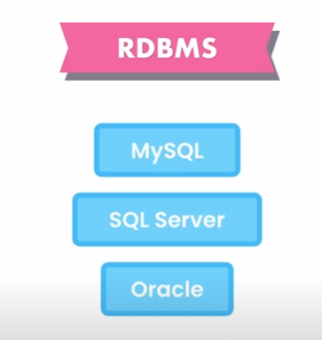

What is a Database?
A database is an organized collection of data stored in a format that allows easy access, management, and retrieval of information.

What is a DBMS?
A Database Management System (DBMS) is software that interacts with the database. We connect to a DBMS to issue instructions for querying, updating, or modifying data within the database.

Relational Data
Relational data refers to data that is organized in a way that shows relationships between different pieces of information. For example, a business might have related data tables for customers, orders, and products, where each table connects logically to others.

Using SQL for Relational Data
SQL (Structured Query Language) is the standard language used to manage and manipulate relational data. SQL allows us to query, update, and organize data within relational databases.

Different Relational Database Management Systems (RDBMS)
Various RDBMS platforms support SQL, and while each one may have slight differences in implementation, they all follow the core SQL standards. Here are some of the most popular RDBMS systems:

MySQL: Open-source and widely used for web applications.
PostgreSQL: Known for advanced features and standards compliance.
SQLite: Lightweight, often used for mobile apps and small projects.
Microsoft SQL Server: A commercial option by Microsoft, used extensively in enterprise settings.
Oracle Database: Known for scalability and often used in large enterprise environments.
SQL Implementation Across RDBMS
The implementation of SQL is largely similar across different RDBMS systems, as they all adhere to core SQL specifications. However, each system may offer unique extensions and features that provide additional functionality

4.we use sql for relational data

different relationbal database managment systems are slightly differernt these are some fo the most popular. there are many.

implement is very simular and is based of standard sql specifications.

no relationsal databases dont use sql.

mysql.
